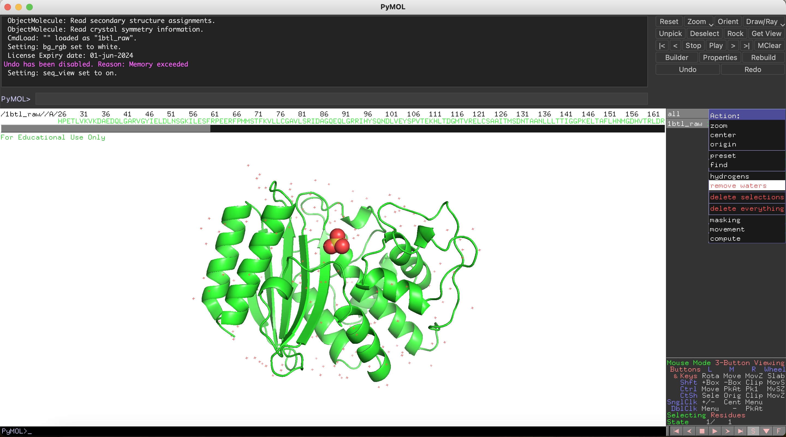

# Guide for PyMOL

## Initial steps with PDB

Download PBD ID: [1BTL]

rename it as `1btl_raw.pdb`

Start PyMOL and load `1btl_raw.pdb` 

From Display show the `Sequence`

Sequence is now shown

Click `A` button next to `all` and select `remove waters` 

Scroll to the right on Sequence and click on S04

click the `A` button next to `(sele)` and click `remove atoms`

Now we are going to save the new file

Go to `File` and select `Export Molecule`

Click `Save`

Type name as `1btl` (without pdb extension) and then select `PDB` from the menu below and click `Save`

Now we created `1btl.pdb`

(Compare with `1btl.pdb` in the Beta-lactamase folder on github)

## Make a mutation with PyMOL

Download `WT_cript.pdb` from PDZ folder on github

Start PyMOL and load `WT_cript.pdb` 

From Display show the `Sequence`

From `Wizard` go to `Mutagenesis` and select `Protein`

As an example we are going to make the `S102Y` mutation

From the `Sequence` click on `S102`. This will select residue `S102` and show options on the right panel

On the right panel click `No Mutation` and from the new panel select `TYR`

Using the arrows at the bottom of the right panel select a side chain rotamer with least amount of clashes (shown as red regions on the protein). After selecting the rotamer, first click `Apply` then click `Done`

Go to `File` and select `Export Molecule`

click `Save`

Type the name of the new pdb file as `WT_cript_S102Y` (without pdb extension) and then select `PDB` from the menu below and click `Save`

Now we created `WT_cript_S102Y.pdb`

[1BTL]: https://files.rcsb.org/download/1BTL.pdb
